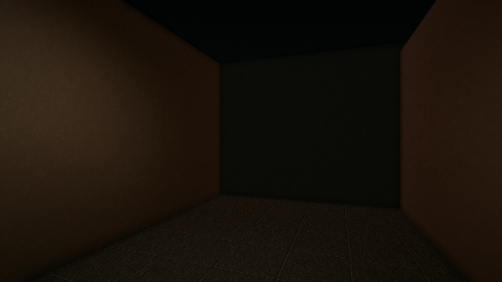
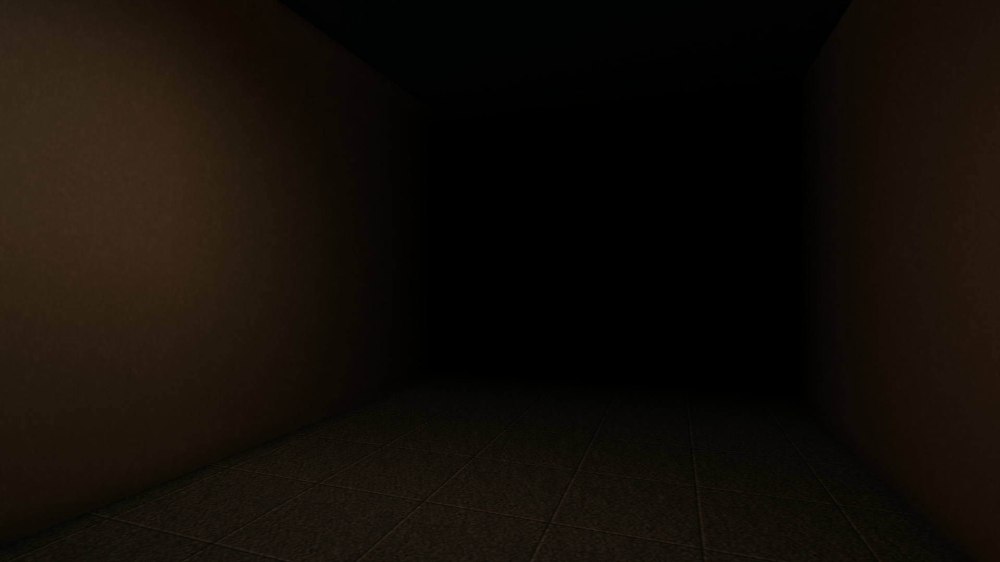

# Custom-Shader-Transparent-Cube-Darkness-Unity
A transparent cube shader that creates a smooth gradient of darkness across the interior walls, with adjustable back wall darkness, side falloff, maximum opacity, and edge transparency.

<table> <tr> <th align="center">Without Shader</th> <th align="center">With Shader</th> </tr> <tr> <td align="center">  </td> <td align="center">  </td> </tr> </table>
